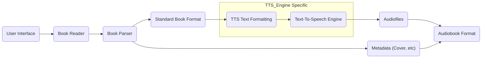

[](https://www.python.org)
[](https://github.com/pre-commit/pre-commit)
[](https://github.com/astral-sh/ruff)
[](http://mypy-lang.org/)

# TTS Audiobook Creator
Convert books to audiobooks using AI based text to speech (TTS).

## Installation
Make sure to have Python 3.11 installed and create a virtual environment.

Install the requirements by using:
```bash
pip install -r requirements.txt
```

## Usage
By default the program will use the sample epub in the `sample_data` directory with the default voice. To use a different book or voice update the `config.toml` file.

### Using the UI
This is the recommended way to use the program. It gives more fine grained control over the process and the option to preview the audiobook.
```bash
python tts_audiobook_creator/ui.py
```

### Using the CLI
To generate an audiobook for the whole book without the UI use the following command:
```bash
python main.py
```

## Detailed Development Installation
The following steps are for a detailed installation of the development environment. Note that for every step there are multiple ways to i.e. install python, create an environment or install dependencies. The following steps are just one way to do it.


1. Install `Pyenv`:
    https://github.com/pyenv/pyenv#installation
2. Install `python 3.11.8`:
    ```bash
    pyenv install 3.11.8
    ```
3. Install pyenv-virtualenv:
    https://github.com/pyenv/pyenv-virtualenv

4. Create a virtual environment:
    ```bash
    pyenv virtualenv 3.11.8 tts-audiobook-creator
    ```
5. Enable and use the virtual environment:
    ```bash
    pyenv local tts-audiobook-creator
    pyenv activate tts-audiobook-creator
    ```
6. Install poetry:
    ```bash
    pip install poetry
    ```
7. Install the dependencies:
    ```bash
    poetry install
    ```

## Data Flow


## Book Type Format
```python
book = {
    "title": "Title",
    "author": "Author",
    "chapters": [
        {
            "title": "Chapter Title",
            "body": "Chapter Text",
            "audio_path": "{Path to audio file}"
        }
    ]
}
```
